Live kernel patching
=========================

Your company is in a period of high volume business critical activity and cannot afford the risk of taking down either of the HANA hosts for maintenance however you have just been advised of a critical kernel vulnerability.

RHEL versions 7.7 and 8.1 introduced live kernel patching functionality via kpatch for all subscriptions, which allows for select critical and important security kernel patches to be applied without a reboot.

Overview
========

In this lab exercise, you will identify vulnerable systems and automatically apply live kernel patches on your lab instances.

Logging into Tower
==================

Your Ansible Tower instance url and credentials were supplied to you on the page created for this workshop.

Identifying Vulnerable Systems
======================

For your lab environment, there are 2 smart inventories are pre-created:

- RHEL 8 - (List of all RHEL 8 systems)
- RHEL 8 - Vulnerable (List of all vulnerable systems)

First, run **Lab 4 - Check Vulnerabilities** job template to identify any vulnerable systems.

Step 1:
-------

Select **TEMPLATES**

Step 2:
-------

Click the rocketship icon  for the
**Lab 4 - Check Vulnerabilities**

Step 3:
-------

When prompted, select **cve_2019_11135**

**Note:** For more information on this vulnerability: https://nvd.nist.gov/vuln/detail/CVE-2019-11135

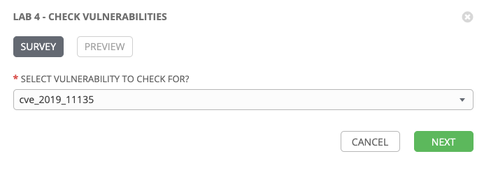

Step 4:
-------

Select **NEXT** and preview the inputs.

Step 5:
-------

Select LAUNCH 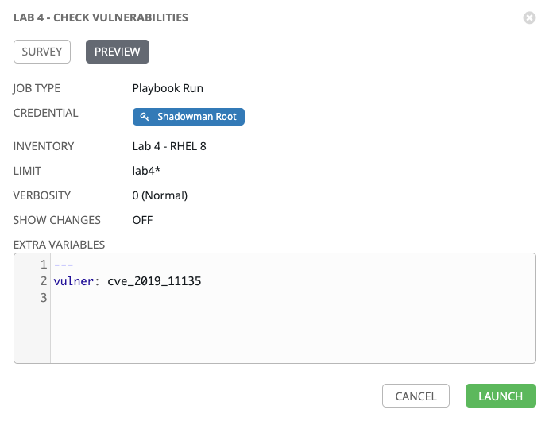

Step 6:
-------

Sit back, watch the magic happen

One of the first things you will notice is the summary section. This
gives you details about your job such as who launched it, what playbook
it’s running, what the status is, i.e. pending, running, or complete.

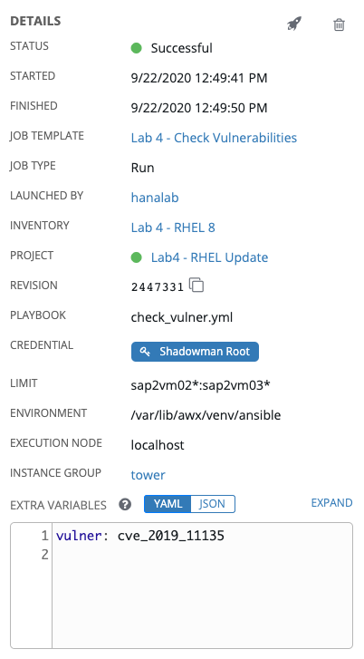

Next you will be able to see details on the play and each task in the
playbook.

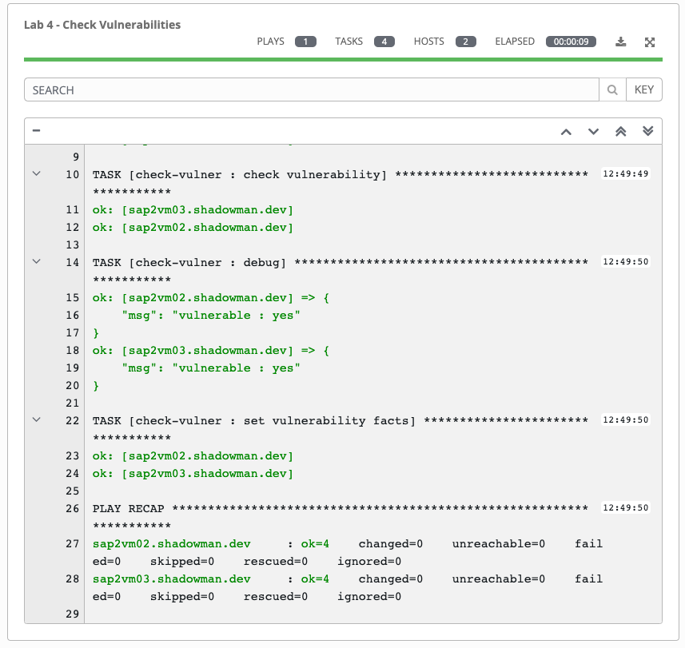

Step 7:
-------

When the job has successfully completed, you should see which systems are vulnerable (yes/no).

Validating Smart Inventory
======================

Step 1:
-------

After running the job template, results will be now reflected in the inventory **RHEL 8 - Vulnerable**.

Navigate to **INVENTORIES**

Step 2:
-------

Click **Lab 4 - RHEL 8 - Vulnerable**.

Step 3:
-------

Review **SMART HOST FILTER** field, it's only listing RHEL 8.1 vulnerable systems.

Step 4:
-------

Click the **HOSTS** tab and review the system(s) listed.

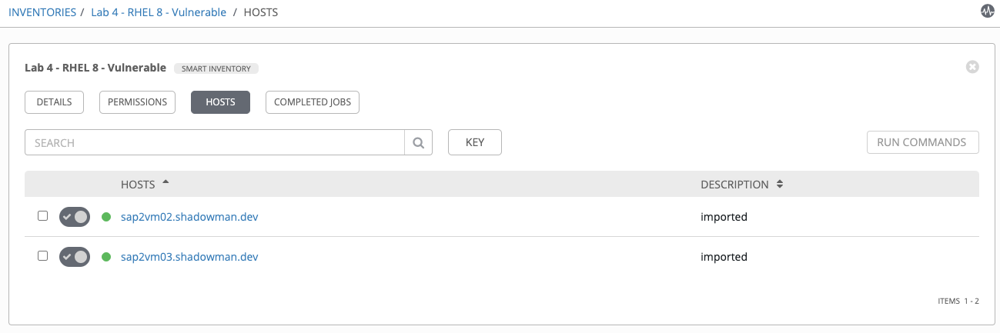

Fixing Vulnerable Systems
======================

Now that you verified the vulnerable systems, you can run the **Lab 4 - Live Kernel Patch** job template to update those systems without distrbuting the services running.

Step 1:
-------

Select **TEMPLATES**

Step 2:
-------

Click the rocketship icon  for the
**Lab 4 - Live Kernel Patch**

Step 3:
-------

When prompted, confirm Limit and click **Next**.

Step 4:
-------

Click **LAUNCH**.

Step 5:
-------

When the job has successfully completed, you should see the systems that are patched in the details view:

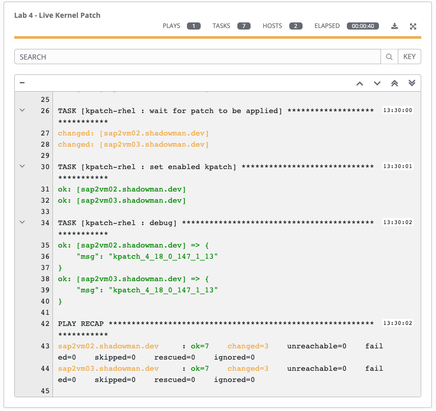

Re-checking Vulnerable Systems
======================

After running the **Lab 4 - Live Kernel Patch** job template, all systems should patched and vulnerabilities should be gone.

Step 1:
-------

Select **TEMPLATES** and re-run **Lab 4 - Check Vulnerabilities**

Step 2:
-------

After answering the survey question and running, validate that systems are not vulnerable anymore.

Step 3:
-------

Navigate to **INVENTORIES > Lab 4 - RHEL 8 - Vulnerable** and verify that no hosts are listed in the dynamic inventory.

Challenge Exercise: Putting it all together
======================

Wouldn't it be nice if you could put this all together in a nice Workflow (potentially with an approval step) so that you wouldn't need to run through individual job templates manually.

In this exercise you will create a workflow template for checking, fixing and validating vulnerable systems.

Step 1:
-------

Navigate to **TEMPLATES**.

Step 2:
-------

Click the  icon and select **Workflow Template**

Step 3:
-------

Complete the form using the following values (leaving other fields blank):

| Key          | Value                                        | Note |
|--------------|----------------------------------------------|------|
| Name         | Lab 4 - Validate and Patch Vulnerabilities   |      |
| Description  | Template for fixing vulnerabilities          |      |
| Organization | Default                                      |      |

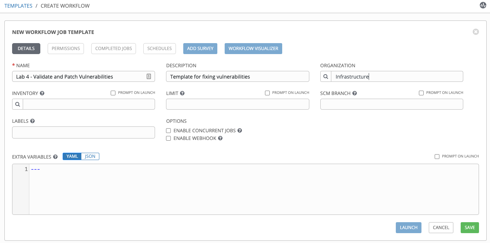

Step 4:
-------

Select SAVE 

Step 5:
-------

You will see and empty canvas where you can start including job templates.

Select START 

Step 6:
-------

In **ADD A NODE** dialog box on the right side of the window, select **Lab 4 - Check Vulnerabilities**

Step 7:
-------

Click PROMPT 

Step 8:
-------

When prompted, select **cve_2019_11135**

Select **NEXT** and preview the inputs.

Step 9:
-------

Select CONFIRM 

Step 10:
--------

Click SELECT 

Step 11:
--------

Hover over the newly added **Lab 4 -Check Vulnerabilities box** and click 

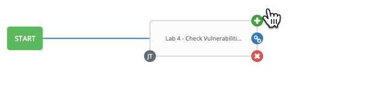

Step 12:
--------

In **ADD A NODE** dialog box on the right side of the window, select **Lab 4 - Live Kernel Patch**

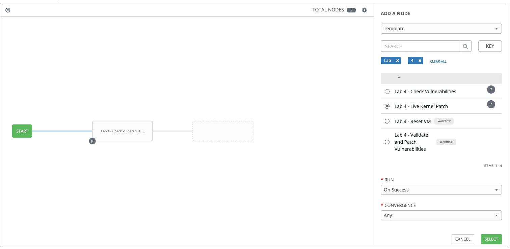

Step 13:
--------

Click SELECT 

Step 14:
--------

Repeat steps 6-10 and add **Lab 4 - Check Vulnerabilities** again as the 3rd node.

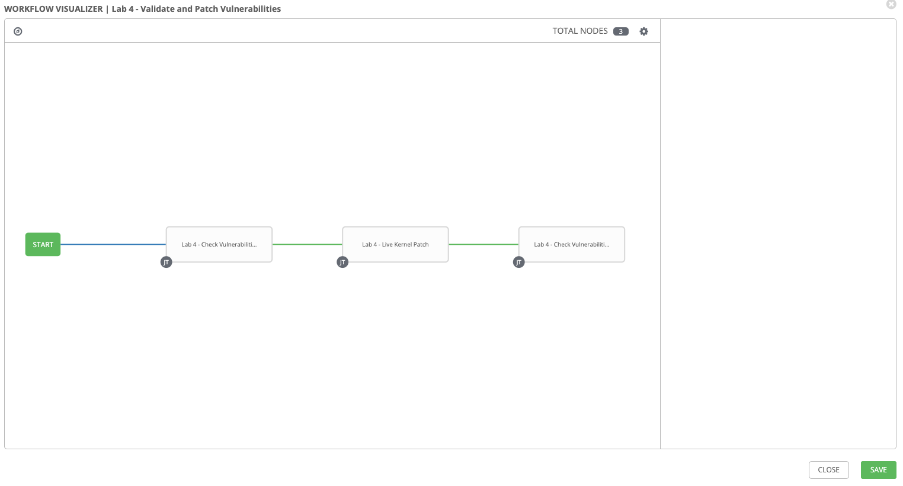

Step 15:
-------

Select SAVE 

Step 16:
-------

Back on the main Workflow Template page, select SAVE
 again.

Running Validate and Patch Vulnerabilities Workflow Template
======================

Now you can test the Workflow template that you just created.

Step 1:
-------

Select **TEMPLATES**

Step 2:
-------

Click the rocketship icon  for the
**Lab 4 - Validate and Patch Vulnerabilities**

Alternatively, you can click LAUNCH  on the Workflow Template view.

Step 3:
-------

After you launch the workflow template, you will see the top-level view:

You can click "Details" on individual nodes to see the detailed view of jobs as the nodes gets run

Step 4:
-------

Review the details of each node, are the results as expected? Any vulnerability found?

**Hint**: Vulnerabilities were previously fixed on all HANA servers but not on the S4 host (sap2vm01).

Challenge Exercise: Add S4 host to list of hosts and add approval step in the workflow
======================

In this challenge exercise, you will incorporate S4 host into the limit, add an approval node in the workflow and re-run.

This time add S4 host (sap2vm01) to the limit to check and potentially fix any vulnerabilities.

**Hint**: You can either change the limit for both 'Lab 4 - Check Vulnerabilities' and 'Lab 4 - Live Kernel Patch' job templates (i.e. tag_role_s4app).

**Hint**: You can add an approval node to the canvas by selecting 'Approval Node' from the drop down as opposed to 'Template'.

### Example solution

Click here

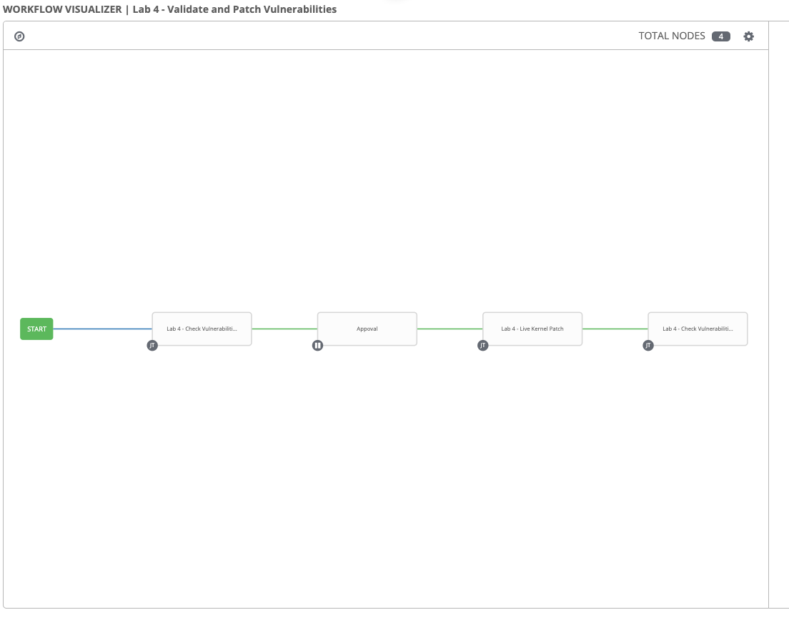

