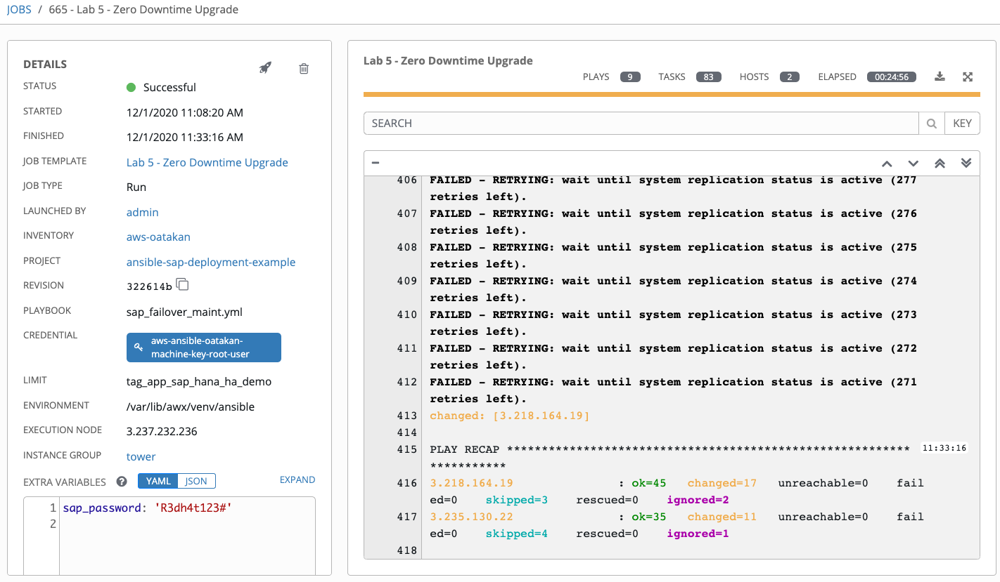
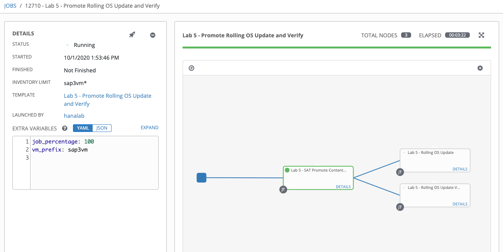
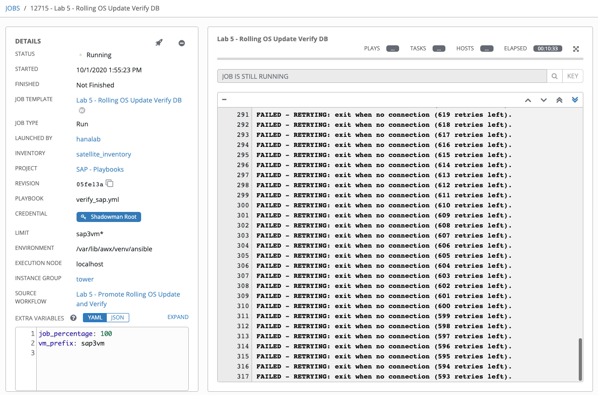

Zero downtime patching
=========================

Your company is now out of the critical phase experienced in the previous lab and it’s time for monthly patching.
Key requirement here is to perform patching without disrupting services running and automatically perform OS and application patches while rebooting and keeping the services up & running in HA configuration.

In a real world environment, you can also incorporate any manual steps that may be required into the workflow process, for example HW upgrade or fixes.

Overview
========

In this lab exercise, you will perform OS upgrade on HANA systems without any downtime. During the upgrade application server will be serving connection through the backup server.

In the workshop environment, you will perform the OS update as part of a worfklow (pipeline) on production environment.
In this example you will also promote content on satellite from Development environment to Production. In a real world scenario you can
have another workflow template test the new content (updates etc) on pre-production environment and promote at end of
successful update.

You will run Rolling update which will be performed o each HANA instance one-at-a-time (50%) and it will be rebooted at any given time, because 
you have HA configured in your environment, it will automatically switch to the other instance. Likewise when it moves 
to working on the 2nd system, 1st system will be booted up and operational to receive new connections while the 2nd system is being upgraded.

Further reading on this scenario: [Reducting downtime for SAP HANA](https://www.redhat.com/cms/managed-files/pa-sap-hana-reducing-downtime-overview-f22788pr-202004-en.pdf).

Logging into Tower
==================

Your Ansible Tower instance url and credentials were supplied to you on the page created for this workshop.

Zero Downtime Upgrade
======================

In this exercise, you will perform rolling OS update with zero downtime on HANA HA cluster which will require kernel
update and a reboot.

Step 1:
-------

Select **TEMPLATES**

Step 2:
-------

Click the rocketship icon  for the
**Lab 5 - Zero Downtime Upgrade**

Step 3:
-------

When prompted, select "aws-hana" in **Inventory** tab

Select **NEXT** and preview the inputs

Step 4:
-------

Select LAUNCH.

Here are the high level steps performed in this playbook:

- determine primary/secondary HANA systems
- unregister secondary from the cluster
- perform OS update on the secondary and reboot
- register the secondary system to the cluster and ensure active replication
- promote the secondary system as primary
- unregister the newly demoted secondary from the cluster
- perform OS update on the newly demoted secondary and reboot
- register the newly demoted secondary to the cluster and ensure active replication

Step 5:
-------

After the upgrade is finished, you will see the **Lab 5 - Zero Downtime Upgrade** job complete. You can review the
steps and note the validation steps.

Challenge Exercise: Test Unplanned Outage
======================

In this exercise, you will test an unplanned outage on pre-prod environment to observe fail-over and any interruption to
user experience.

Step 1:
-------

Select **TEMPLATES**

Step 2:
-------

Click the rocketship icon  for the
**Lab 5 - Test Unplanned Outage**

Step 3:
-------

When prompted, in **Other Prompts** tab:

**Limit:** sap2vm* (make sure you type '*' at the end as this will match multiple VMs)

**vm_prefix:** sap2vm

Select **NEXT** and preview the inputs.

Step 4:
-------

Select LAUNCH.

Step 5:
-------

There are two branches in the workflow:

**1:** verify: check user experience during the update (ensure connection to database at all times)

**2:** rolling update: update OS and kernel to the latest level and reboot one-at-a-time on both HANA systems

Right-click in each box as it's running and open in a new window to observe both jobs running. You can keep the windows side-by-side to see the execution details.

Step 5:
-------

After the upgrade is finished, you will see the **Lab 5 - Rolling OS Update** job complete.

The **Lab 5 - Rolling OS Update Verify DB** other job may still be running until it reaches the time-out period to 
observe.

The fact that it didn't exit early with a failure means the DB connection has not been interrupted from the user
perspective during the upgrade. You should see a status report at the end of the observe period.

Challenge Exercise: Non-rolling Update
======================

Now that you've done the proper way of upgrading your HANA systems with zero-down time, you may be wondering what would happen if you upgrade both HANA systems at the same time? This is clearly not recommended for production environment but if you're upto the challenge and want to see how the environment behaves you can perform this exercise.

In this exercise you will run through the same job template as in the previous challenge exercise **Lab 5 - Rolling Update**. This time you want to run on both HANA systems in parallel.

**Hint**: Did you notice that we included a variable **job_percentage: 50**, this controls the 'serial' strategy on the rolling update playbook. What value would you need to change this to so that it runs on both (all) HANA systems at the same time?

What was your observation? Was there any interruption in **Lab 5 - Rolling OS Update Verify DB** job?

**Hint**: For this exercise, we included a step in the playbook to reboot the systems even no updates are required to simulate an interruption.

