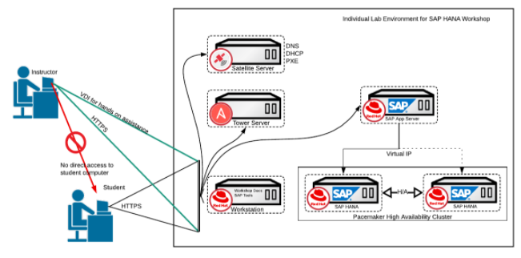
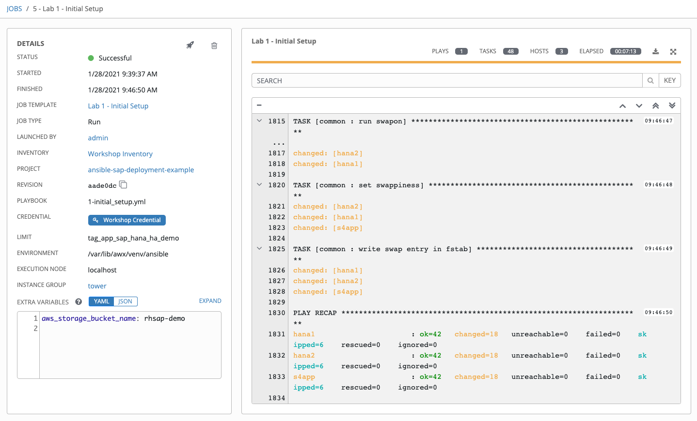
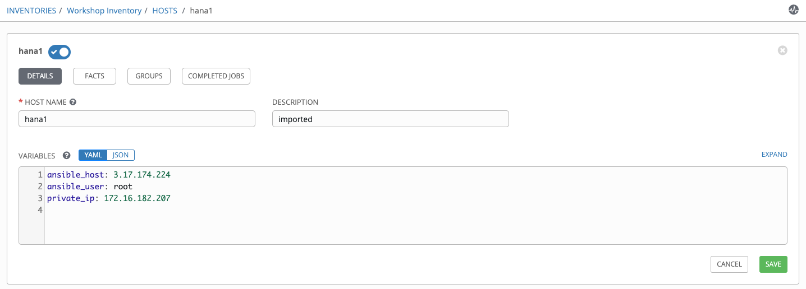
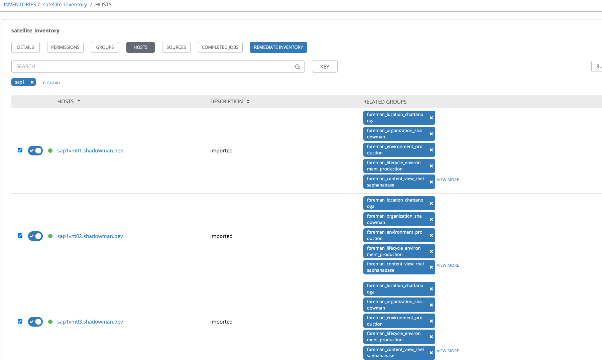
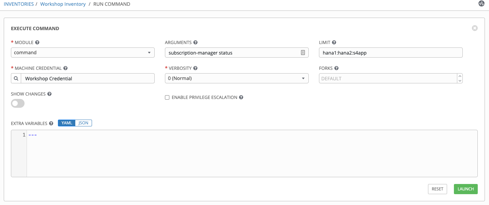
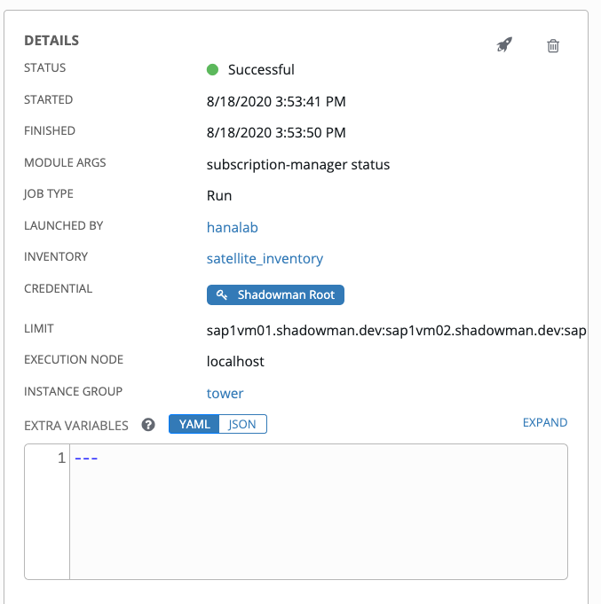
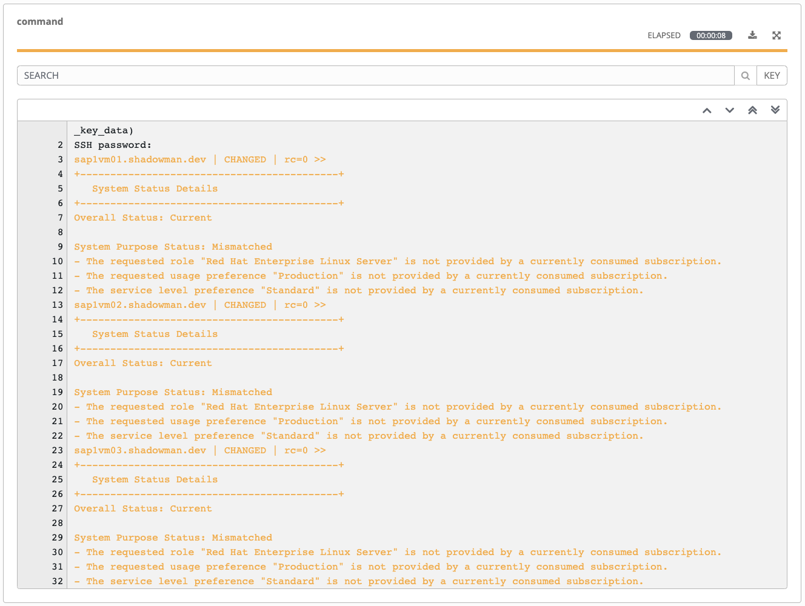

Deploying RHEL SAP HANA Environment
=========================

We have a requirement for a new two node HANA Cluster and the virtual hardware has been provisioned. Each participant connects to a hosted environment which includes

- Workstation
- Satellite
- Tower

In addition to these systems, you will provision a new RHEL 8.1 based SAP HANA environment:

- 2 SAP HANA VMs in an HA config
- 1 SAP App Server VM

Ansible playbooks and workflow templates are provided to automatically provision these systems onto your student environment. As part of this process:

- VMs will be provisioned from a template via Satellite, this will automatically create the objects needed to manage the RHEL subscriptions for the new systems on the Satellite systems.
- Attach the correct subscription on Satellite
- Mount binary packages and other prerequisite steps to prepare the environment for a succesfull SAP deployment

Overview
========

In this lab exercise, you will log into Tower and request a new SAP HANA environment and validate it's correctly configured.

Logging into Tower
==================

Your Ansible Tower instance url and credentials were supplied to you on the page created for this workshop.

Provision New RHEL SAP Environment
======================

For your lab environment, there is a job template provided that will help you perform the initial configuration of your
SAP environment:

- Lab 1 - Initial Setup (attach SAP subscription and other prereqs)

First, run **Lab 1 - Initial Setup** workflow template to deploy new VMs in your environment. VMs will also be
configured to receive updates from the Satellite server.

Step 1:
-------

Select **TEMPLATES** from the left navigation.

Step 2:
-------

Click the rocketship icon  for the
**Lab 1 - Initial Setup**

Step 3:
-------

Sit back, watch the magic happen

One of the first things you will notice is the details section. This
gives you details about your job such as who launched it, what job template
it’s running, what the status is, i.e. pending, running, or complete.

Step 4:
-------

When the workflow job has successfully completed, you should have 4 systems in your inventory and ready for further automation.

Validating Inventory
======================

In this section, you will validate the inventory that contains newly provisioned VMS.

Step 1:
-------

After running the workflow template, results will be now reflected in the inventory **Workshop Inventory**.

Navigate to **INVENTORIES**

Step 2:
-------

Click **Workshop Inventory**.

Step 3:
-------

Click **GROUPS** tab and click **tag_app_sap_hana_ha_demo**.

Step 4:
-------
Click **Hosts** tab.

Step 5:
-------

Review the newly provisioned systems, **click on one of the hosts** and review the variables, these variables will be
available for any automation as well as via REST API to any external system.

Validating Deployment
======================

In this section, you will execute an ad-hoc command on your environment to validate the subscription status.

Step 1:
-------

After running the workflow template, results will be now reflected in the inventory **Workshop Inventory**.

Navigate to **INVENTORIES**

Step 2:
-------

Click **Workshop Inventory**.

Step 3:
-------

Click **GROUPS** tab and select **tag_app_sap_hana_ha_demo**.

Step 4:
-------

Click the **HOSTS** tab and select each of the VMS by clicking the checkbox next to it. You will then see the **RUN COMMANDS**
button become enabled. Click it now.

This will pop up the **Execute Command** window. From here is where we
can run a single task against our hosts.

Fill out this form as follows

| Key                | Value           | Note                                                            |
|--------------------|-----------------|-----------------------------------------------------------------|
| Module             | `command`      |                                                                 |
| Arguments          | `subscription-manager status`                | subscription-manager status                                           |
| Limit              |                 | This will be pre-filled out for you with the hosts you selected |
| MACHINE CREDENTIAL | `Workshop Credential`         | select the default Workshop Credential                                                              |

Once you click **LAUNCH** you will be redirected to the Job log. Every
job and action in Ansible Tower is recorded and stored. These logs can
be auto-rotated and can also be exported automatically to another
logging system such as Splunk or ELK.

The first part of the log shows you the details of the job. This
includes information such as who launched the job, against what hosts,
and when.

The second part of the job log shows you the actual output from the
command. If your connection was successful, you should see a result such
as this.

The results should return for all 2 systems:

**Overall Status: Current**

This validated the environment, feel free to repeat the steps above and experiment further by running additional commands.

Behind the scenes with Satellite
==============================

Will add a click through of Satellite to lay the ground work for understanding the concepts in Labs 4 & 5.
