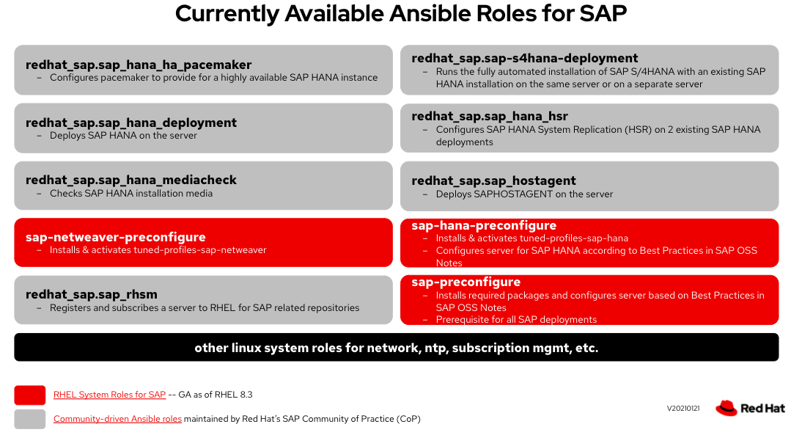
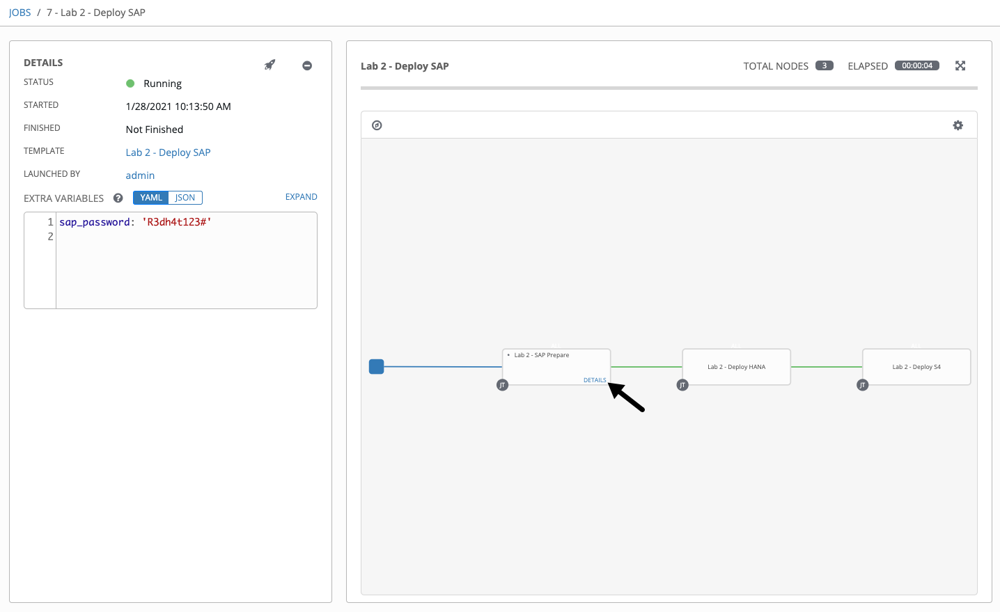
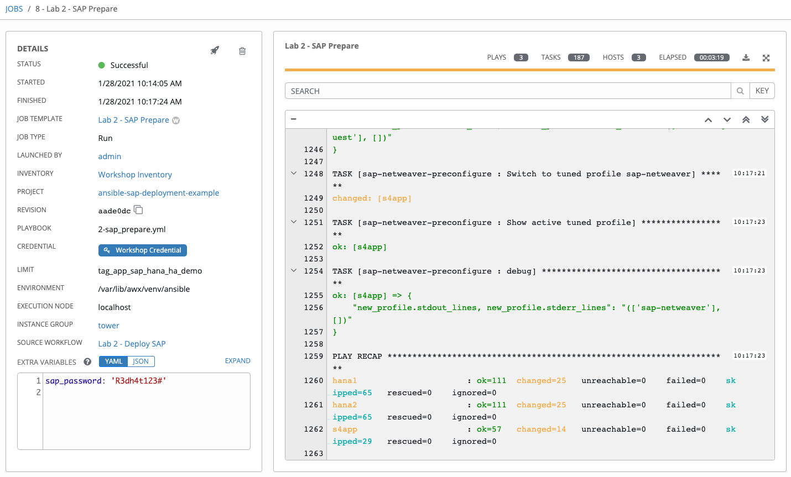
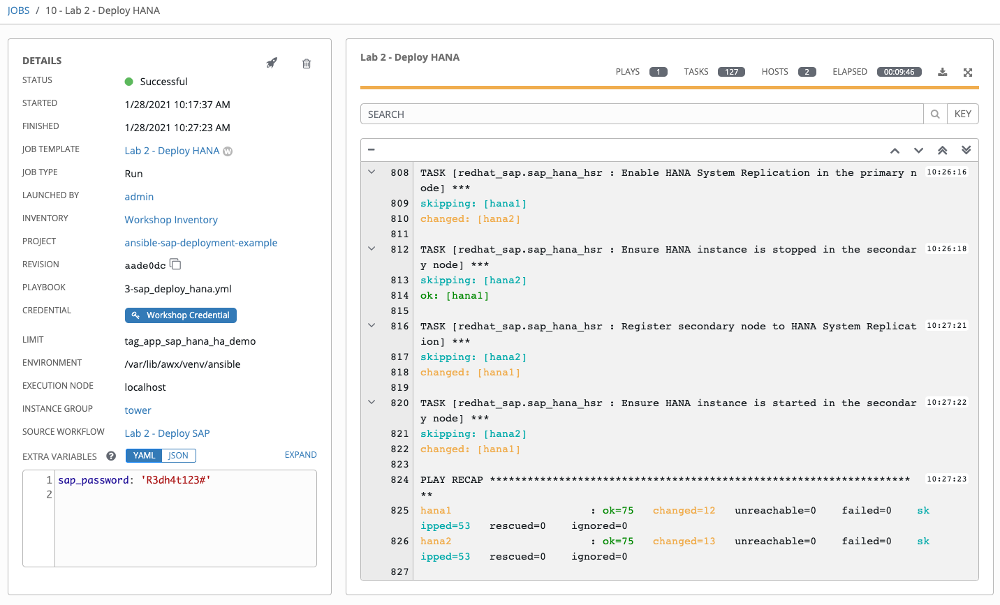
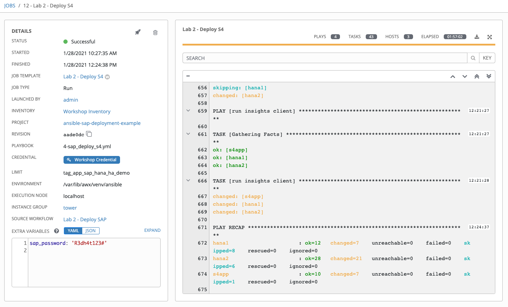

Establishing an HA Cluster
=========================

Now that the servers have been provisioned and properly subscribed to Satellite to receive software and updates, you are
ready to configure the HA Cluster environment.

Overview
========

SAP Host preparation is a complex and long task that traditionally involves multiple teams and expertise to accomplish.
There is not a unique document we can follow in order to get the system configured in the way SAP installers are
expecting. SAP uses ‘OSS Notes’ to capture all these prerequisites and specific configurations that need to be done
prior to deploying the SAP HANA and / or SAP NetWeaver software.

Red Hat Ansible Automation Platform provides a number of specific roles for SAP automation that greatly simplifies this
workflow in a reliable and repeatable way. Ansible Roles are the primary mechanism for breaking Ansible Playbooks into
smaller reusable components. Roles provide a framework for fully independent tasks, or independent collections of
variables, files, templates, and modules. Each role is limited to a particular set of functionality or desired output,
with all of the necessary steps to provide that result either defined within the role, or in other roles that are listed
as dependencies.

For the purposes of this workshop, we broke the deployment into three stages:

1. Preconfigure SAP HANA servers for deployment
2. Deploy HANA servers in HA configuration
3. Deploy S4HANA application server

In a real world scenario, these job templates can be tested by different users and put in a workflow template to run
with one-click. In your lab environment, a workflow template **(Lab 2 - Deploy SAP)** is provided to include all three steps
to deploy SAP.

**Note:** You can run this workflow that includes all the required steps to deploy SAP in HA configuration. In that case you can
review the below steps as the workflow is running. Alternatively, you can run through the steps individually as outlined
below.

Deploy SAP using a Workflow Template
======================

In this exercise, you will run the **Lab 2 - Deploy SAP** workflow template that includes 3 main job templates:

- **Lab 2 - SAP Prepare:** perform prerequsite steps on HANA and netweaver nodes such as set up RHEL SAP repositories,
adjust memory and other OS parameters (refer to Review sections after this exercise for more details)
- **Lab 2 - Deploy HANA:** install and configure HANA nodes in HA configuration (refer to Review sections after this exercise for more details)
- **Lab 2 - Deploy S4:** install and configure S4/HANA nodes in HA configuration (refer to Review sections after this exercise for more details)

Step 1:
-------

Select **TEMPLATES**

Step 2:
-------

Click the rocketship icon  for the
**Lab 2 - Deploy SAP**

Step 3:
-------

When prompted, in **Other Prompts** tab:

**sap_password:** <leave default*>

**Note**: In production environment, you want to create a new secure credential and associate the credential in the job
template so that it never shows up as clear text. For this workshop environment, we leave as a regular variable. For more information on Ansible Tower credential management:
https://docs.ansible.com/ansible-tower/latest/html/userguide/credentials.html

Select **NEXT** and preview the inputs.

Step 4:
-------

Select **LAUNCH**.

Step 5:
-------

You should see the workflow job details view, you can stay on this page until the status is successful, you can also click
the **DETAILS** link on each job node to see the progress:

**Note:** You can review the sections below to get more information for each job node. This whole process takes between
**60-90** minutes. You can check with your instructor on the next steps while the deployment is in progress.

**Note:** When the workflow job has successfully completed, you should have all SAP nodes fully deployed.

Preconfigure SAP HANA servers (Review Only)
======================

In this exercise, you will run a job template that includes 3 roles:

##### - sap-preconfigure (runs on all nodes):
This Ansible role will ensure that prerequsite steps are applied on all nodes such as adjusting selinux, memory and
other OS parameters

##### - sap-netweaver-preconfigure (on S4 node):
This Ansible role will ensure that netweaver specific pre-configuration steps are performed on S4 node.

##### - sap-hana-preconfigure (on hana nodes):
This Ansible role will ensure that HANA specific pre-configuration steps are performed on HANA nodes.

Run **Lab 2 - SAP Prepare** job template to prepare the SAP environment by performing the pre-configuration steps
on all nodes.

Step 1:
-------

Select **TEMPLATES**

Step 2:
-------

Click the rocketship icon  for the
**Lab 2 - SAP Prepare**

Step 3:
-------

When prompted, in **Other Prompts** tab:

**sap_password:** <leave default*>

**Note**: In production environment, you want to create a new secure credential and associate the credential in the job
template so that it never shows up as clear text. For this workshop environment, we leave as a regular variable. For more information on Ansible Tower credential management:
https://docs.ansible.com/ansible-tower/latest/html/userguide/credentials.html

Select **NEXT** and preview the inputs.

Step 4:
-------

Select **LAUNCH**.

Step 5:
-------

When the job has successfully completed, you should have all SAP nodes pre-configured.

Deploy HANA servers in HA configuration (Review Only)
======================

In this exercise, you will run a job template that will deploy HANA in HA clustered configuration. The job template
includes the following roles:

##### - redhat_sap.sap_rhsm:
This Ansible role will ensure that Red Hat Enterprise Linux Server nodes are properly registered with the Satellite server.
It will also ensure that required repositories for 'RHEL for SAP Solutions' are attached to the RHEL hosts. Additionally,
it will ensure the hosts are registered with Red Hat Insights.

##### - redhat_sap.sap_hostagent:
This Ansible role will ensure the SAP Host Agent is installed and running on all hosts.

##### - redhat_sap.sap_hana_deployment:
This Ansible role will ensure that SAP HANA is installed on both HANA nodes which will later be configured with HA.
This role will utilize ansible variables and performs an unattended installation, variables are defined along with the
Ansible playbook and stored in a source control repository. You can provide credentials and user provided variables from
Ansible Tower.

##### - redhat_sap.sap_hana_hsr:
This Ansible role will ensure that HANA System Replication (HSR) is configured and functioning on both of the SAP HANA
servers.

##### - redhat_sap.sap_hana_ha_pacemaker:
This Ansible role will ensure PCS is installed and configured to support underlying clustering at the OS level between
the HANA nodes. This role requires a Virtual IP(VIP) as an input parameter. In your lab environment this will provided
as part of the job template as a survey question.

Run **Lab 2 - Deploy HANA** job template to deploy HANA servers in HA clustered configuration.

Step 1:
-------

Select **TEMPLATES**

Step 2:
-------

Click the rocketship icon  for the
**Lab 2 - Deploy HANA**

Step 3:
-------

When prompted, in **Other Prompts** tab:

**sap_password:** <leave default*>

**Note**: In production environment, you want to create a new secure credential and associate the credential in the job
template so that it never shows up as clear text. For this workshop environment, we leave as a regular variable. For more information on Ansible Tower credential management:
https://docs.ansible.com/ansible-tower/latest/html/userguide/credentials.html

Select **NEXT**.

Step 4:
-------

Select **LAUNCH**.

Step 5:
-------

When the job has successfully completes, you should have HANA deployed as HA cluster in your environment.

Deploy S4/HANA (Review Only)
======================

In this exercise, you will run a job template that will deploy S4/HANA application server. The job template includes the
following roles:

##### - redhat_sap.sap_rhsm:
This Ansible role will ensure that Red Hat Enterprise Linux Server nodes are properly registered with the Satellite server.
It will also ensure that required repositories for 'RHEL for SAP Solutions' are attached to the RHEL hosts. Additionally,
it will ensure the hosts are registered with Red Hat Insights.

##### - redhat_sap.sap_hostagent:
This Ansible role will ensure the SAP Host Agent is installed and running on all hosts.

##### - redhat_sap.sap_s4hana_deployment:
This Ansible role will ensure that S4/HANA is installed and configured with a backend HANA installation from the
previous lab. This role will utilize ansible variables and performs an unattended installation, variables are defined
along with the Ansible playbook and stored in a source control repository. You can provide credentials and user provided
variables from Ansible Tower. This role requires a Virtual IP(VIP) as an input parameter. In your lab environment this will provided
as part of the job template as a survey question.

Run **Lab 2 - Deploy S4** job template to deploy S4/HANA application server.

Step 1:
-------

Select **TEMPLATES**

Step 2:
-------

Click the rocketship icon  for the
**Lab 2 - Deploy S4**

Step 3:
-------

When prompted, in **Other Prompts** tab:

**sap_password:** <leave default*>

**Note**: In production environment, you want to create a new secure credential and associate the credential in the job
template so that it never shows up as clear text. For this workshop environment, we leave as a regular variable. For more information on Ansible Tower credential management:
https://docs.ansible.com/ansible-tower/latest/html/userguide/credentials.html

Select **NEXT**.

Step 4:
-------

Select **LAUNCH**.

Step 5:
-------

When the job has successfully completes, you should have HANA deployed as HA cluster in your environment.

