Zero downtime patching
=========================

Our scenario: Your company is now out of the critical phase experienced in the previous lab and it’s time for monthly patching.

Our key requirement here is to perform patching without disrupting services running and automatically perform OS and application patches while rebooting and keeping the services up & running in HA configuration.

In a real world environment, you can also incorporate any manual steps that may be required into the workflow process, for example HW upgrade or fixes.

Overview
========

In this lab exercise, you will perform an OS upgrade on HANA systems without any downtime. During the upgrade application server will be serving connection through the backup server.

In the workshop environment, you will perform the OS update as part of a worfklow (pipeline) on production environment.
In this example you will also promote content on satellite from Development environment to Production. In a real world scenario you can
have another workflow template test the new content (updates etc) on pre-production environment and promote at end of
successful update.

You will run Rolling update which will be performed o each HANA instance one-at-a-time (50%) and it will be rebooted at any given time, because 
you have HA configured in your environment, it will automatically switch to the other instance. Likewise when it moves 
to working on the 2nd system, 1st system will be booted up and operational to receive new connections while the 2nd system is being upgraded.

Further reading on this scenario: [Reducing downtime for SAP HANA](https://www.redhat.com/cms/managed-files/pa-sap-hana-reducing-downtime-overview-f22788pr-202004-en.pdf).

Logging into Tower
==================

Your Ansible Tower instance url and credentials were supplied to you on the page created for this workshop.

Zero Downtime Upgrade
======================

In this exercise, you will perform rolling OS update with zero downtime on HANA HA cluster which will require kernel
update and a reboot.

Step 1:
-------

Select **TEMPLATES**

Step 2:
-------

Click the rocketship icon  for the
**Lab 5 - Zero Downtime Upgrade**

Here are the high level steps performed in this playbook:

- determine primary/secondary HANA systems
- unregister secondary from the cluster
- perform OS update on the secondary and reboot
- register the secondary system to the cluster and ensure active replication
- promote the secondary system as primary
- unregister the newly demoted secondary from the cluster
- perform OS update on the newly demoted secondary and reboot
- register the newly demoted secondary to the cluster and ensure active replication

Step 3:
-------

Select default prompts and click **LAUNCH**

After the upgrade is finished, you will see the **Lab 5 - Zero Downtime Upgrade** job complete. You can review the
steps and note the validation steps.

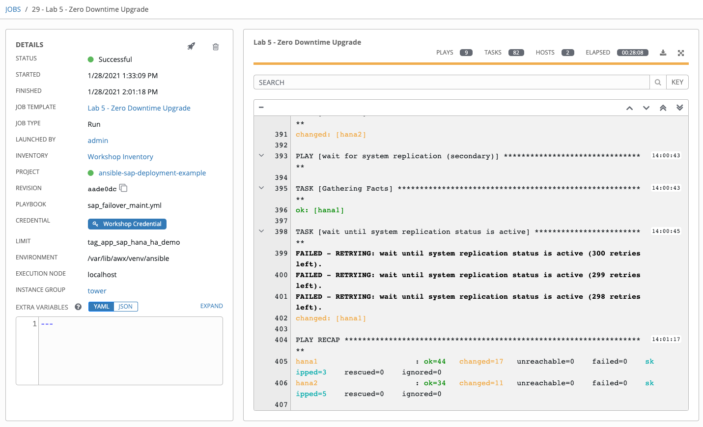

Challenge Exercise: Test Unplanned Outage (Review Only)
======================

In this exercise, you will test an unplanned outage on pre-prod environment to observe fail-over and any interruption to
user experience.

Step 1:
-------

Select **TEMPLATES**

Step 2:
-------

Click the rocketship icon  for the
**Lab 5 - Test Unplanned Outage**

Step 3:
-------

There are two branches in the workflow:

**1:** verify: check user experience during the update (ensure connection to database at all times)

**2:** rolling update: update OS and kernel to the latest level and reboot one-at-a-time on both HANA systems

Right-click in each box as it's running and open in a new window to observe both jobs running. You can keep the windows side-by-side to see the execution details.

**Understanding the role of Satellite [Optional]**

If the workshop envirnoment includes a Red Hat Satellite we will explore some of the capabilities that make this process easier to manage.

Logging into Satellite
----------------------

The class shares a single instance of Satellite. The URL and credentials were supplied to you at the begining of the worksho, please ask your instructor for assistance if you don not have them at hand.

After authenticating you will land on the Satellite Dashboard

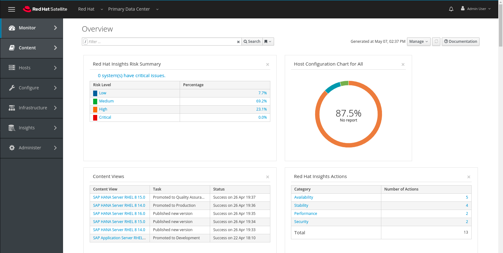

Hover over **Content** then clikc on **Red Hat Repositories**

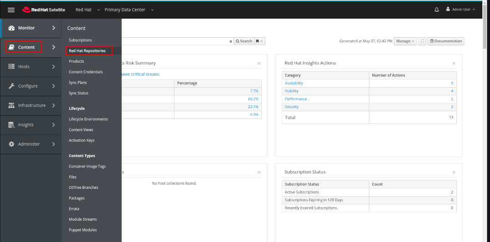

Note the some of the pertinent repositiories highlighted in this screen. The repositiores on the right hand are those that the administorator has slected for use in his or her environement. Only content that is actually needed is selected and replicated locally.

Hover over **Content** and click on **Content Views**

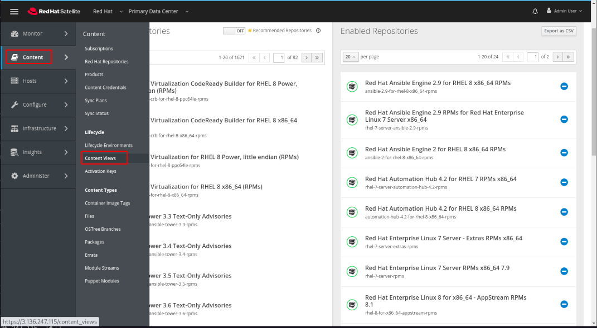

In this view we can see all of the Content Views whihc have been created on this Satellite. A content view can be thought of as a database select against tables (repositories) which results in a group of packages applicable for a certain usages, such as a Standard Operating Environment (SOE) which could be used ubiquitously as a standard base across all servers using a major version of RHEL. Note that we have highlighted three particular Content Views here which we will explore in the next steps. Also not that one is a **Composite Content View**, this is a special use case which allows administrators to enhance efficicnecy and consistency by using and SOE a consistent base for specialized servers. 

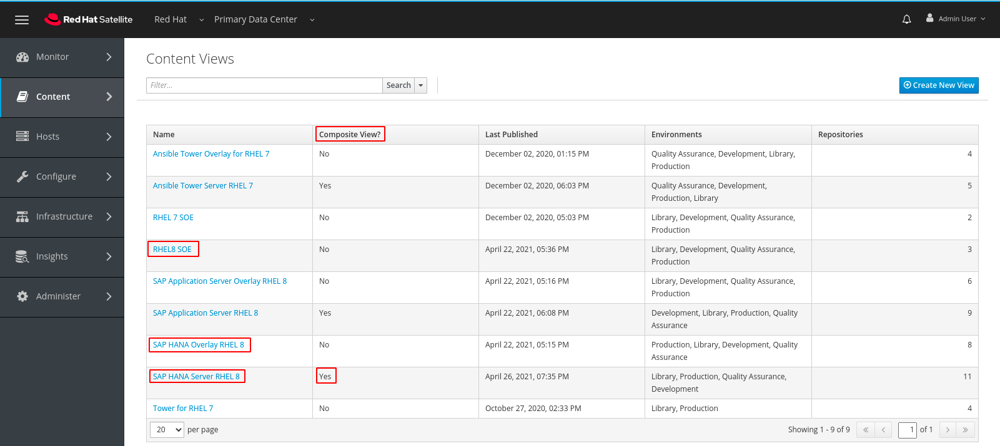

Click on the link **RHEL8 SOE**

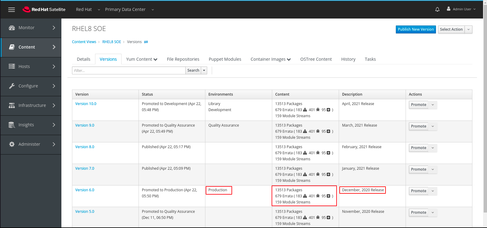

In this view note that we have a version assigned to the **Production Environment**. Note that the number of errata included in earlier versions is lower and in later versions is higher and that this version is related to a certain point in time. This version represents a point in time view of the **SOE**. To see how we manage this point in time view click on **Yum Content** and then on **Repositories**.

In this view we can see the three repositories which define the SOE. Note that they have been recently syncchronized with the latest packages from the Red Hat Content Delivery Network, much more recently than the date of our Production version of the RHEL8 SOE. By creating point in time versions of a Content View Red Hat provides customers the ability to easily manage operating systems as they do applications using a lifecycle management concept.

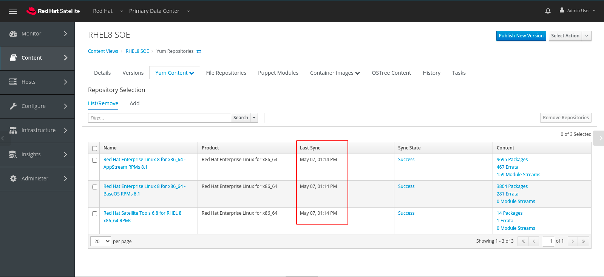

To understand how this is managed click on **Yum Content** and then on **Filters**

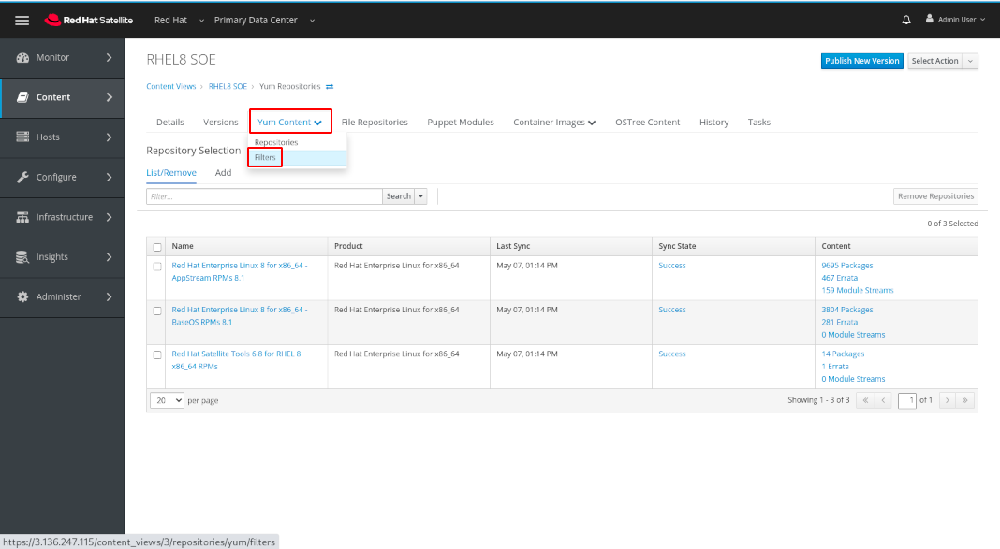

In the next view click on **Monthy Release Filter** 

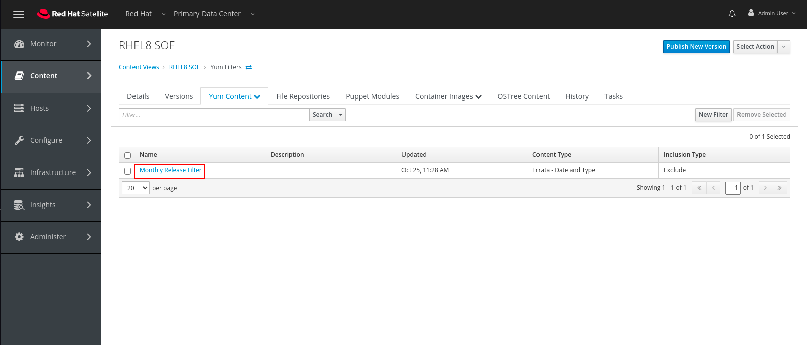

In this view we can see that the administrator has created a filter which affects all three types of errata based on the date they were most recnetly updated and filters **out** any updated **after** a certain date. Filters are customer defined and very flexible, for the purposes of this workshop we have simply focused on creating a monthly release cadence. If you would like to explore the possibilities futhre please discuss this with the instructor of one of the other facilitators.

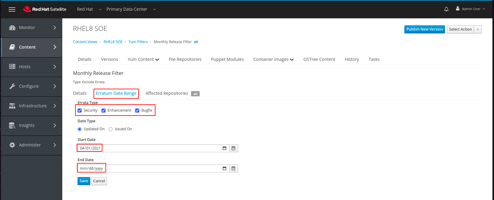

The next step in our exploration will be to see the way in which we can create another Content View which can overlay and augment the SOE to meet the needs of the servers we are managing in this workshop. Click on **Content Views**

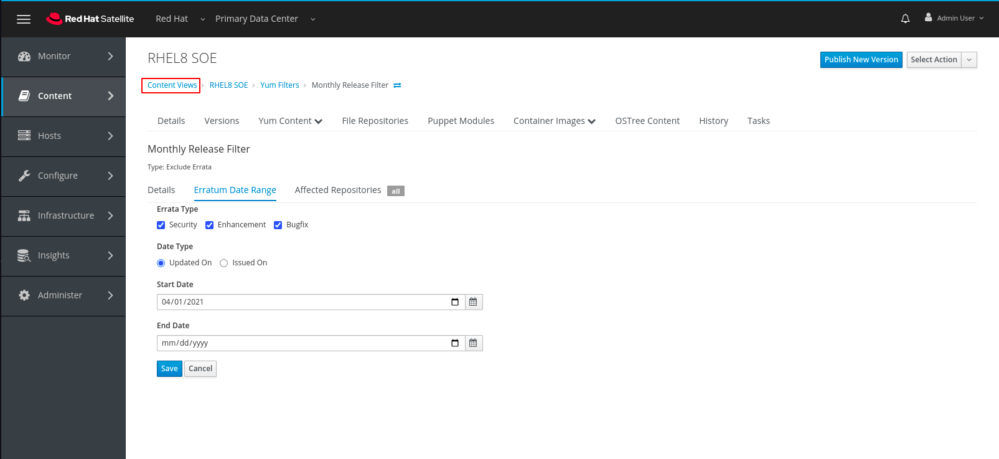

Then click on **SAP HANA Overlay RHEL 8**

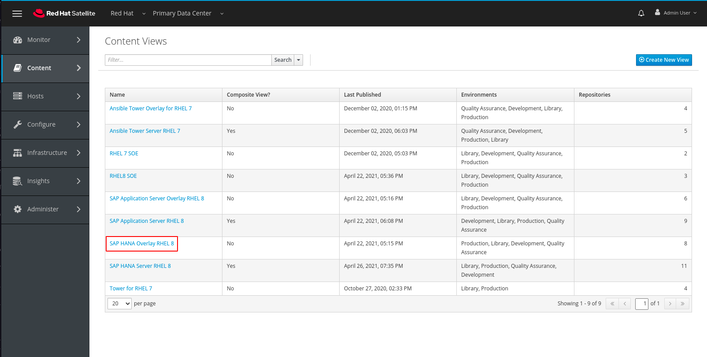

In this view we can see that we use the same concepts as in the SOE. Multipe versions with one assigned to the Production Lifecycle.

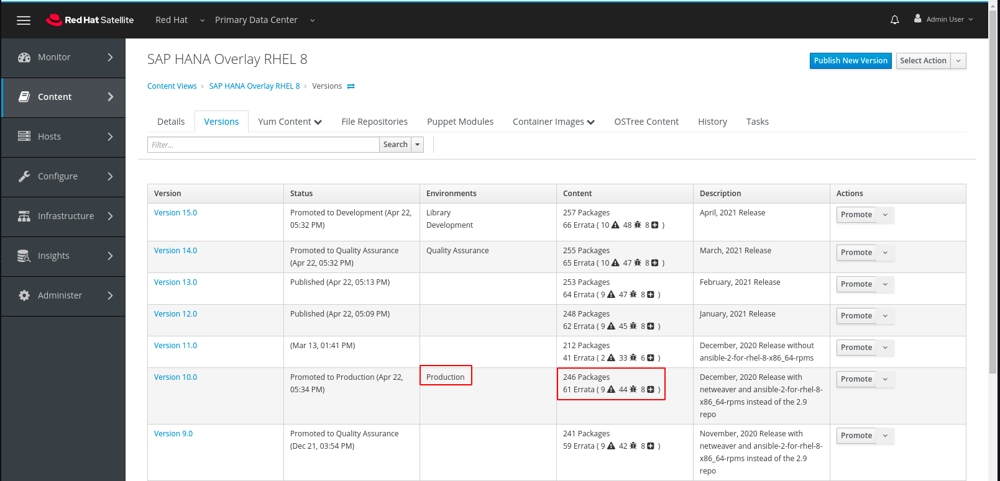

Click on **Yum Content** and then on **Repostories**

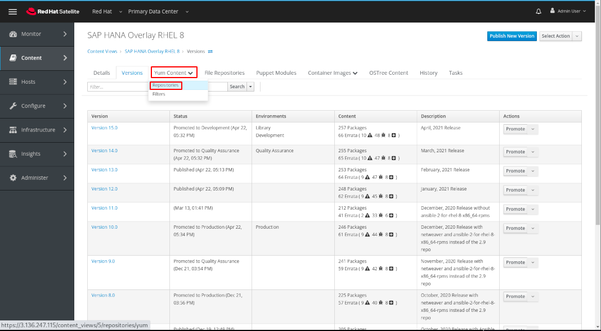

In this view we can see the additional repositories the administrator has selelctec to augnet the SOE so that it can support an SAP HANA workload.

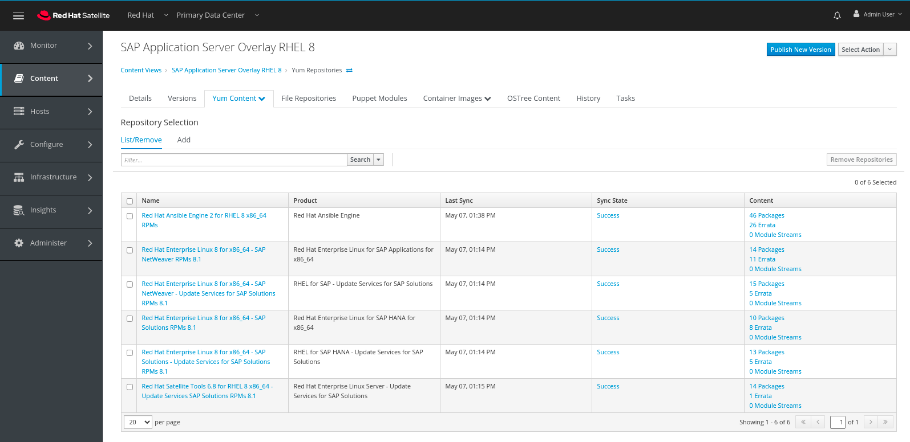

Click on **Content Views**

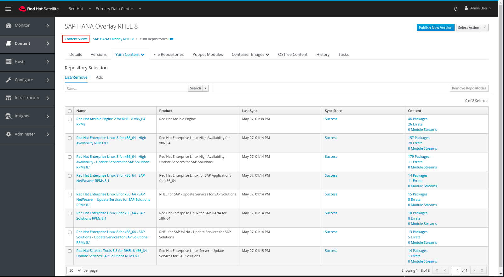

Click on **SAP HANA Server RHEL 8**

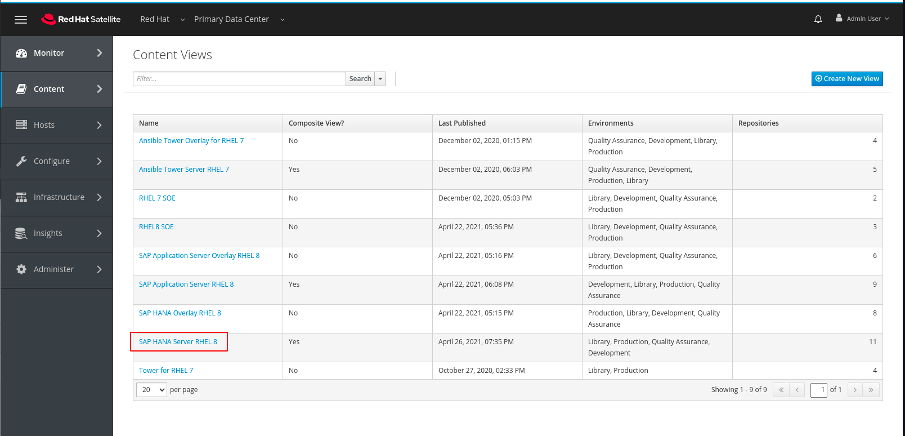

In this view we can see essntially the same Content View concept with one easily noticeable difference, and **Content Views** tab. Click on the **Content Views** tab.

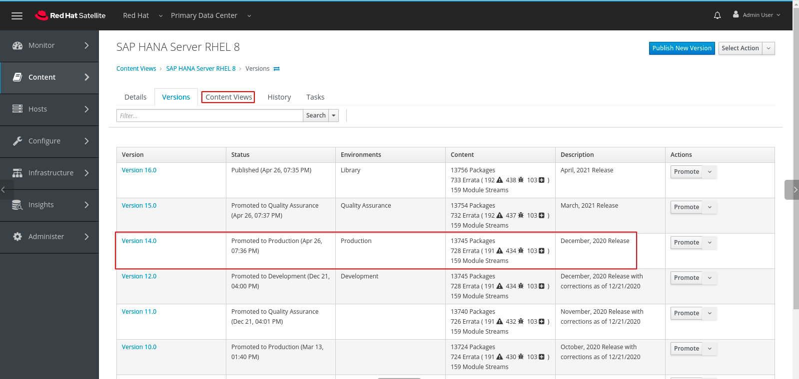

This screen shows the two standard Content Views which make up this **Composite Content View** you may note that the **Environments** show Library and Development, this is only the most recent state. Composite Content Views also use versions

Step 4:
-------

After the upgrade is finished, you will see the **Lab 5 - Test Unplanned Outage** job complete.

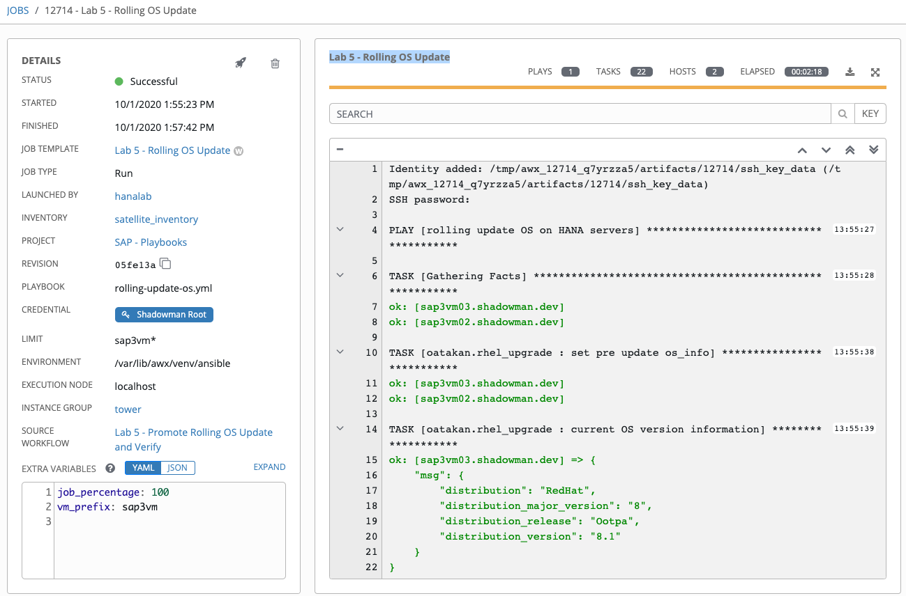

The **Lab 5 - Rolling OS Update Verify DB** other job may still be running until it reaches the time-out period to 
observe.

The fact that it didn't exit early with a failure means the DB connection has not been interrupted from the user
perspective during the upgrade. You should see a status report at the end of the observe period.

Challenge Exercise: Non-rolling Update
======================

Now that you've done the proper way of upgrading your HANA systems with zero-down time, you may be wondering what would happen if you upgrade both HANA systems at the same time? This is clearly not recommended for production environment but if you're upto the challenge and want to see how the environment behaves you can perform this exercise.

In this exercise you will run through the same job template as in the previous challenge exercise **Lab 5 - Test Unplanned Outag**. This time you want to run on both HANA systems in parallel.

**Hint**: Did you notice that we included a variable **job_percentage: 50**, this controls the 'serial' strategy on the rolling update playbook. What value would you need to change this to so that it runs on both (all) HANA systems at the same time?

What was your observation? Was there any interruption in **Lab 5 - Rolling OS Update Verify DB** job?

**Hint**: For this exercise, we included a step in the playbook to reboot the systems even no updates are required to simulate an interruption.

